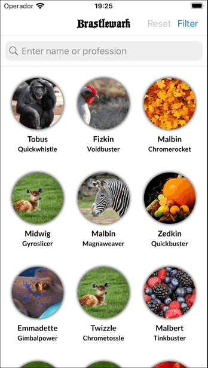

## Introduction

This is a mobile technical test for an iOS position made for [Axa](https://www.axa.com/en) in june 2022. The explanation and requisites for the technical test are attached to this repository too in a PDF file called "Brastlewark_mobile_test"

  

## Basic architecture

The archicture decisions made for this project are based in the following:
- the **SOLID principles**, the general and basic rules that every code project should follow. Single responsibilities for elements, use of interfaces to comunicate elements or layers, so we could keep hidden for each other, etc. 
- the **MVVM pattern**, to build the relations between views, data, logic and user interactions. Although other patterns like VIPER are more often in the iOS platform, I personally feel more comfortable with this pattern as it fits better to how I think about programming. 
- the **Clean Architecture** basis, nicely described by our loved [Uncle Bob](https://blog.cleancoder.com/uncle-bob/2012/08/13/the-clean-architecture.html), where all the elements that build up a software system are divided in three basic layers (**presentation**, **domain** and **data**) and the communication and knowledge of each other existance is clearly limited. Although the folder structure is not setup exactly like that, all project elements follow the criteria for the layer they belong to.

## Views and View Models

To follow the MVVM pattern we must implement its two basic actors: **Views** and **View Models**. This poject uses a custom class called `Box` to represent those types in View Model that can be subscribed by the View using the method `bind()`. In this way, View just reacts when the data changes in View Model.

The View Models are plain classes called `ViewModel` that are defined through two protocols.
- `ViewModelOutput`, declares what data the Views can subscribe to
- `ViewModelInput` defines what view related events the Views can communicate to the View Model. 

View Models work with classes named `UseCases` to manipulate domain data, use domain logic and achieve any other goal needed for Views. View Models are never injected with data, instead the always use the classes `UseCases` to get de data they need.

The Views are both `UIViewControllers` and `UIViews`. A View receive by injection its ViewModel and subscribe to the desired data throught the method `binds()`, where they implement what to do when the data change (usually, the action is to update its own view or their associated ones). View are only responsible to show the data coming from its own View Model and to communicate user interface events to it.

## Models and mappers

Models are just structs or classes to represent plain data with its basic logic associated. Models are used to communicate data between elements and layers, but **they don't implement** any domain or bussines logic.

To keep layers independent between each other, usually models are different and not shared between layers. Instead, each layer defines its own models, and the translation between them are made by extensions called `Mappers`.

For example, Views use its own kind of models suffixed with `Ui` in order to be absolutely independent for the rest of the app system. In this way, we could change the UI without affect other system models, just the `Ui` ones; or we could redefine the domain or logic models, but if the UI keeps the same, the `Ui` models will be kept too.

## Use cases

The use cases define the bussines or domain logic, those what is considered the core of our system and what defines our bussines intention. They obtain data from different sources, manipulate the data, apply its logic to it, and return it to the View Models.

Use cases are define in plain classes named `UseCases`. They define a method `execute()` that triggers the action they were defined for, clearly expressed in its own class name. They are defined as asynchronous methods, because bussines logic do not know anything about **where data is coming from** (network, data bases, device), and thus we don't know how long the execution is going to take. 

For this asynchronous nature we use the new Swift featre `async/await`.

## Sources of data

The repositories are the sources of data used across the app. In this project are defined two main data sources: network and non persistent:
- `NetworkRepository` is the repository that fetchs the data from its original remote source. 
- `NonPersistentRepository` is the one used for temporary allocated data, that is, data that is only available during the life cycle of the app, or until it's intentionally invalidated.

In the middle of those repositories, we have a cache manager called `CachedRepository` that retrieves data from network only once, the first call, and the stores it and retrieves it from non persistent state.

For networking operations the app uses the new Swift framework `Combine`.

## Dependency injections

A basic tecnhique to keep all elements and layers independent from each other, and thus improve code maintainability and encourage testeability, is dependency injection. With this tecnique, every actor in the system receives other actors they need to perform its responsability, instead of create them by its own. Besides, elements **depend always on protocols or interfaces**, instead of a particular element.

When a new View (usually a `UIViewController`) is going to be presented, it triggers the injection process through a method called `inject(withSegue:)`. The associated View Model and the needed use cases and respositories are instantiated and assignated to each other. This process is always managed by a class suffixed with `DI` (standing for "Dependecy Injection").

## Navigation

The app navigation is primary based in the use of **scenes in a storyboard**, and the defined **segues** to represent the avialable transitions between these scenes.

The View Model defines an observable enumerated property named `transitionTo`, whose values correspond to the **same segues** declared in the storyboard for this scene. When `transitionTo` changes, the View reacts to this change and starts the navigation process. Every scene has an associated file suffixed as `Router` with the methods `route(transitionTo:)` and `prepare(forSegue:)` that trigger the injection process just before the next `UIViewController` is fully loaded.

The final purpose is to uncouple the navigation process from the `UIViewController` and be able to apply dependency injection just where the iOS views life cycle permits.

## Third party libraries

The following third party libraries are used via Cocoapods in this project:

- [SDWebImage](https://github.com/SDWebImage/SDWebImage), a well known library to handle with the image downloading and cache.
- [MultiSlider](https://github.com/yonat/MultiSlider), an useful double slider control used to pick a range of values.
- [Mockingjay](https://github.com/kylef/Mockingjay), an elegant library to mock HTTP responses and used during unit testing.

## What's next...

There are some improvements and new features that could be included in future releases...
- expect the **city name** in the JSON file as a dynamic property, not always set to the given `brastlewark`, and keeping the rest of JSON structure the same as now.
- following the later, to **select the city** when the app starts for first time, not always "Brastlewark".
- implement the details UI inside of a `UIScrollView`, so if there are more character data in the future, or more friends per character, the user could scroll down to see all of it.
- implement the filter UI with a `UITableViewController`, and implement different `UITableViewCell` objects for every type of indivudal filter that is needed (i.e., a cell for sliders, a cell for one-single-option tables, a cell for multi-option tables, etc,).
- include **UI testing**, using the framework `XCUITest` or even **snapshot testing**.
- more tests in general, not thinking of 100% of coverage (that's not useful, it's just a number), but instead real and useful unit tests and functional tests to coverage the real core of the app.
- rethink the whole UI/UX like icons, fonts, colors, interactions, CTAs... I'm trying to be a good developer, not a good designer 😜
